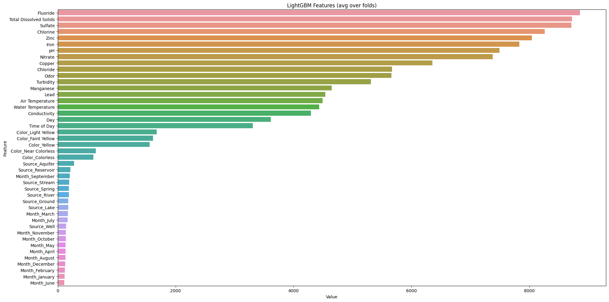
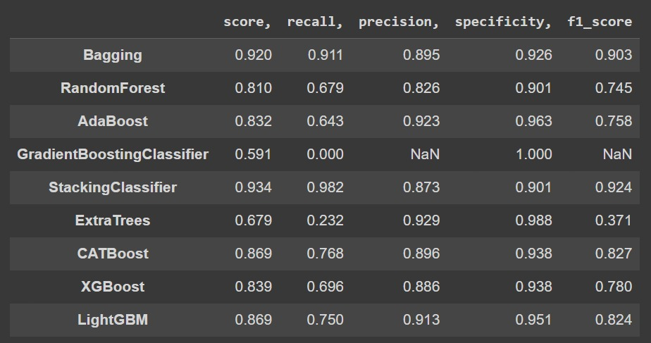
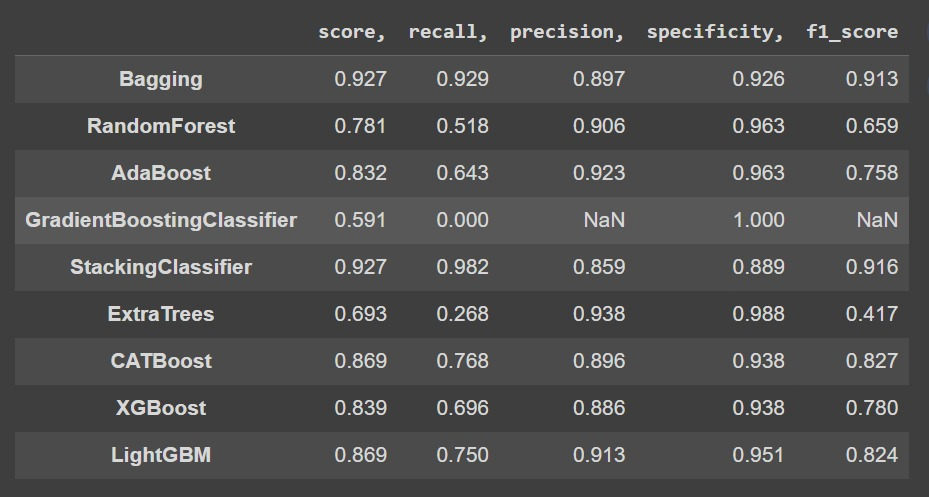

# Leveraging Intel® oneAPI Libraries for Intelligent Water Quality Prediction with AI Stacking Ensemble

## Table of Contents

- [Tech Stack Used](#tech-stack-used)
- [Feature Selection and Imputation](#feature-selection-and-imputation)
- [Synthetic Data Generation](#synthetic-data-generation)
- [Various Models Used](#various-models-used)
- [Final Technique: Stacking](#final-technique-stacking)
- [Final Results](#final-results)
- [References](#references)

## Tech Stack Used

- **Programming Language**: Python
- **Libraries**:
  - scikit-learn-intelex
  - modin 
  - ctgan
  - hyperopt
  - pyDeepInsight
  

## Feature Selection and Imputation

### Feature Selection Steps:

1. **Handling Missing Data**: The project initially addressed missing data by dropping rows with NaN values, taking into consideration that nan values for each feature were less than 2%. This ensured that the remaining data was largely complete.

2. **Feature Importance Analysis**: A feature importance analysis was conducted on the dataset using techniques like Random Forest Feature Importance or Gradient Boosting Feature Importance. This analysis helped identify the most relevant features for modeling.

3. **Feature Removal**: Based on the feature importance analysis, less relevant or redundant feature columns were removed to improve the efficiency of the model and reduce the dimensionality of the dataset. The following features where dropped based on its over all feature importance. ['Source', 'Month']

### Feature Imputation Steps:

1. **Categorical Data Handling**: Categorical data was handled by applying one-hot encoding to convert categorical variables into numerical format.

2. **Data Distribution Analysis**: Density graphs were plotted for each feature to analyze their data distributions.

3. **Imputation Based on Data Distribution**: Univariate imputation techniques were used due to the data characteristics and the limited number of missing values. Specifically:
   - For features with a normal distribution, missing values were imputed using the mean of that feature.
   - For features with skewed distributions, missing values were imputed using the median of that feature.

4. **Columns with Imputed Values**: Below is the list of columns where imputation was performed, along with the method used for each:
   - Mean Imputation:
     - ['pH','Air Temperature']
   - Median Imputation:
     - ['Iron', 'Nitrate', 'Chloride', 'Lead', 'Zinc' , 'Turbidity', 'Fluoride', 'Copper', 'Total Dissolved Solids', 'Water Temperature','Chlorine', 'Conductivity', 'Sulfate', 'Odor', 'Manganese', 'Day', 'Time of Day']

The decision to use univariate imputation techniques like mean and median was made based on the data characteristics and the small number of missing values, which eliminated the need for more advanced techniques such as MICE.

## Synthetic Data Generation

### Synthetic Data Using CTGAN Model

To address the challenge of a highly imbalanced dataset, synthetic data was generated using the CTGAN (Conditional Tabular GAN) model. CTGAN is a state-of-the-art generative adversarial network (GAN) specifically designed for generating synthetic tabular data. It learns the underlying data distribution and generates synthetic samples that closely resemble the original data while preserving statistical properties.

CTGAN was chosen for synthetic data generation due to its ability to:

- Balance the class distribution in the dataset, effectively addressing class imbalance issues.
- Generate synthetic data that captures the intricate relationships between features present in the original dataset.

### Use Case for Synthetic Data

The need for synthetic data arose from the substantial class imbalance in the original dataset. By generating synthetic samples with CTGAN, we balanced the class distribution, creating a more representative and balanced dataset. This balanced dataset was then used for training machine learning models, improving their performance and generalization.

By leveraging synthetic data, we aimed to enhance the model's ability to make accurate predictions on underrepresented classes, ultimately improving the overall model performance and fairness.

## Model Performance Comparison using scikit-learn-intelex

| Model Name                  | Time (with scikit-learn-intelex)      | Time (without scikit-learn-intelex) | 
|-----------------------------|---------------------------------------|-------------------------------------|
| RandomForestClassifier      | 3.2 milliseconds                      | 19.4 milliseconds                   |
| BaggingClassifier           | 4.2 milliseconds                      | 3.53 milliseconds                   |
| AdaboostClassifier          | 20.9 milliseconds                     | 32.2 milliseconds                   |
| GradientBoostingClassifier  | 4.1 milliseconds                      | 1.39 milliseconds                   |
| ExtraTreesClassifier        | 15 milliseconds                       | 22.4 milliseconds                   |
| SVM Classifier              | 10.1 milliseconds                     | 21.4 milliseconds                   |
| XGBoost                     | 3.86 milliseconds                     | 4.64 milliseconds                   |
| CatBoost                    | 2.69 milliseconds                     | 1.79 milliseconds                   |
| LightGBM                    | 6.49 milliseconds                     | 3.49 milliseconds                   |

- **Score Comparison**
  - 
  - 
  
## Final Technique: Model Stacking

In our project, we employed a model stacking approach to harness the strengths of multiple classifiers. The following classifiers were used in our stacking ensemble:

- CatBoostClassifier
- TabNetClassifier
- LGBMClassifier
- XGBClassifier
- BaggingClassifier
- DecisionTreeClassifier

## Stacking Model Performance
|     | precision  | recall | f1-score |
|-----|------------|--------|----------|
| 0   | 0.99       | 0.82   | 0.89     |
| 1   | 0.80       | 0.98   | 0.89     |

- Accuracy 0.89

## Leveraging DeepInsight: A Novel Approach

In our project, we explored an experimental and unique approach inspired by the "DeepInsight" methodology introduced in the paper titled "DeepInsight: A methodology to transform non-image data into an image for convolution neural network architecture." The paper addresses the challenge of capturing subtle variations in diverse types of data, including genomic and non-genomic, to differentiate phenotypes or categories.

### Transforming Non-Image Data into Well-Organized Images

DeepInsight proposes a groundbreaking concept: the transformation of non-image samples into well-organized image-form representations. This transformation makes it possible to harness the power of convolutional neural networks (CNNs) for data types that were traditionally not amenable to CNN-based analysis. 

### Experimental Use Case

In our project, we adopted the DeepInsight methodology to convert our non-image data into structured image representations. This allowed us to leverage the capabilities of CNNs, including GPU utilization, for a novel and experimental analysis of our dataset. By applying CNNs to non-image samples, we aimed to extract imperative information and explore new avenues for data analysis.

### Promising Results

Our experiment with DeepInsight yielded promising results, showcasing the potential of this innovative approach to unlock hidden patterns and insights within our dataset. While this method may be unconventional, it demonstrates our commitment to exploring cutting-edge techniques in pursuit of deeper understanding and more accurate predictions.

To our knowledge, this project represents one of the pioneering efforts to apply the DeepInsight methodology to our specific domain, further highlighting our dedication to pushing the boundaries of data analysis.

We achieved accracy of 88.7% which is comparative to stacking model.

## References

1. [Modeling Tabular data using Conditional GAN](https://arxiv.org/abs/1907.00503)
2. [DeepInsight](https://alok-ai-lab.github.io/DeepInsight/)

